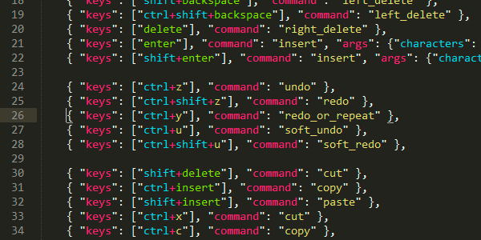

# Sublime Column Select

This plugin provides an alternate behavior for Sublime keyboard column selection.  The differences are:

* Allows reversing direction (go down too far, just go back up).
* Added PageUp/PageDown, Home/End, and mouse selection.
* Skip rows that are too short.
* If you start at the end of a line, then it will stay at the end of each line.

## Installing
The best way to download and install Sublime Column Select is to use the Package Control plugin.  If you do not already have it installed, it's really the best way to manage your packages.

For users new to the package manager:
* Go to https://packagecontrol.io/installation and install Package Control.
* Restart Sublime Text.

Install Sublime Column Select:
* Bring up the Command Palette (`Command+Shift+P` on OS X, `Control+Shift+P` on Linux/Windows).
* Select "Package Control: Install Package" and wait while Package Control fetches the latest package list.
* Select Column Select when the list appears.

Package Control will handle automatically updating your packages.

Alternatively, you can fetch from github:

	git clone git://github.com/ehuss/Sublime-Column-Select.git

and place it in your packages directory.

## Usage
By default it uses the default keystroke for column selection, plus a few extras.  These keystrokes will select the same column in the next or previous line, page (the visible region of the file), or until the beginning/end of the file.

Command | Mac | Windows | Linux
------- | --- | ------- | -----
Up | Ctrl + Shift + Up | Ctrl + Alt + Up | Alt + Shift + Up
Down | Ctrl + Shift + Down | Ctrl + Alt + Down | Alt + Shift + Down
Page Up | Ctrl + Shift + PageUp | Ctrl + Alt + PageUp | Alt + Shift + PageUp
Page Down | Ctrl + Shift + PageDown | Ctrl + Alt + PageDown | Alt + Shift + PageDown
Beginning of file | Ctrl + Shift + Home | Ctrl + Alt + Home | Alt + Shift + Home
End of file | Ctrl + Shift + End | Ctrl + Alt + End | Alt + Shift + End
Select to mouse cursor | Ctrl + Shift + Right-click | Ctrl + Alt + Right-click | Ctrl + Alt + Right-click

### Custom Keystrokes

If you want to use a different keystroke, go to "Preferences" then "Key Bindings - User", and add an entry like this:

	{ "keys": ["ctrl+alt+up"], "command": "column_select", "args": {"by": "lines", "forward": false}},
	{ "keys": ["ctrl+alt+down"], "command": "column_select", "args": {"by": "lines", "forward": true}},
	{ "keys": ["ctrl+alt+pageup"], "command": "column_select", "args": {"by": "pages", "forward": false}},
	{ "keys": ["ctrl+alt+pagedown"], "command": "column_select", "args": {"by": "pages", "forward": true}},
	{ "keys": ["ctrl+alt+home"], "command": "column_select", "args": {"by": "all", "forward": false}},
	{ "keys": ["ctrl+alt+end"], "command": "column_select", "args": {"by": "all", "forward": true}},

Do not include the trailing comma if it is the last entry.

## Contact
If you find a bug, or have suggestions, head over to the github page:
https://github.com/ehuss/Sublime-Column-Select
